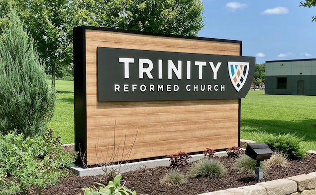

Trinity Reformed Fellowship exists to reach students on the campus of [Indiana University](https://bloomington.iu.edu) with the love of Jesus. We are a ministry of [Trinity Reformed Church](https://trinityreformed.org), a Reformed Protestant church located on the west side of Bloomington, Indiana. We have lively worship on Sunday mornings and regular lunches for students after church.

**Sunday morning services are held at 9am and 11am.** Please [get in touch](https://trinityreformed.churchcenter.com/people/forms/284770) if you'd like a ride!

The best way to know what we're about is to join us for worship on Sunday morning or for college group Bible study on campus. We hope you will!

## What does “reformed” mean?

When we use the word "reformed" in our name, we are pointing to where we came from in history, and to who we are today.

The Protestant Reformation in the 16th century was a white hot explosion of faith in God and in His Word, and we want people to know that we hold to the beliefs which motivated that movement. We *(cough)* **identify** with it. The reformers believed that God is strong and good and that man is weak and wicked, and we think that's about right.

The reformers trusted the words of the Bible when it was very unpopular to do so, and they didn't hide their convictions. They wrote down what they believed so that everyone could see what they were willing to live and to die for. We're doing our best to follow their example. 

## What is Trinity Reformed Church all about?

To learn more about Trinity Reformed Church, please check out the "[What We Believe](https://trinityreformed.org/about/what-we-believe/)" page on our website.

## What is Evangel Presbytery?

Evangel Presbytery is an association of reformed churches which was formed in June, 2019. Trinity Reformed Church is a founding member. To read more about Evangel's commitments, please [click here](https://evangelpresbytery.com/our-commitments/).

## What is a "presbytery"?

The word "presbytery" refers to the way a church is governed. It comes from the Koine Greek word *presbyteros* which means "elder". An example from Scripture can be found in 1 Timothy 5:17:

> The elders (*presbyteros*) who rule well are to be considered worthy of double honor, especially those who work hard at preaching and teaching.

So a presbyterian church is governed by a group of elders within that church. That group of elders includes all the local pastors actively working in that congregation (often referred to as *teaching elders*) and the non-ordained, lay elders.

But unlike *congregational* churches which are not generally answerable to any other church or institution, a church under the presbyterian system of government is answerable to their *presbytery*. A presbytery consists of the pastors and elders of multiple churches who work together for one another's mutual benefit. In our case, our pastors and elders are members of [Evangel Presbytery](https://evangelpresbytery.com).

## What about...?

We'd love the chance to chat with you about any and all questions you might have! Please [get in touch](https://trinityreformed.churchcenter.com/people/forms/284770)!